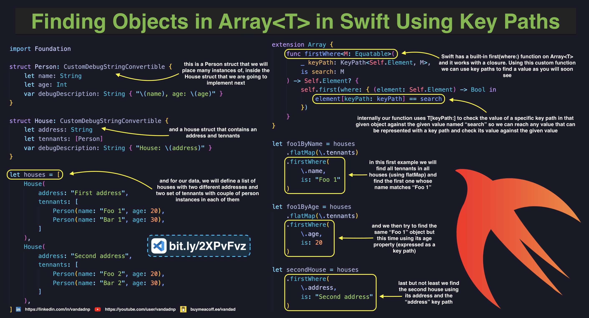
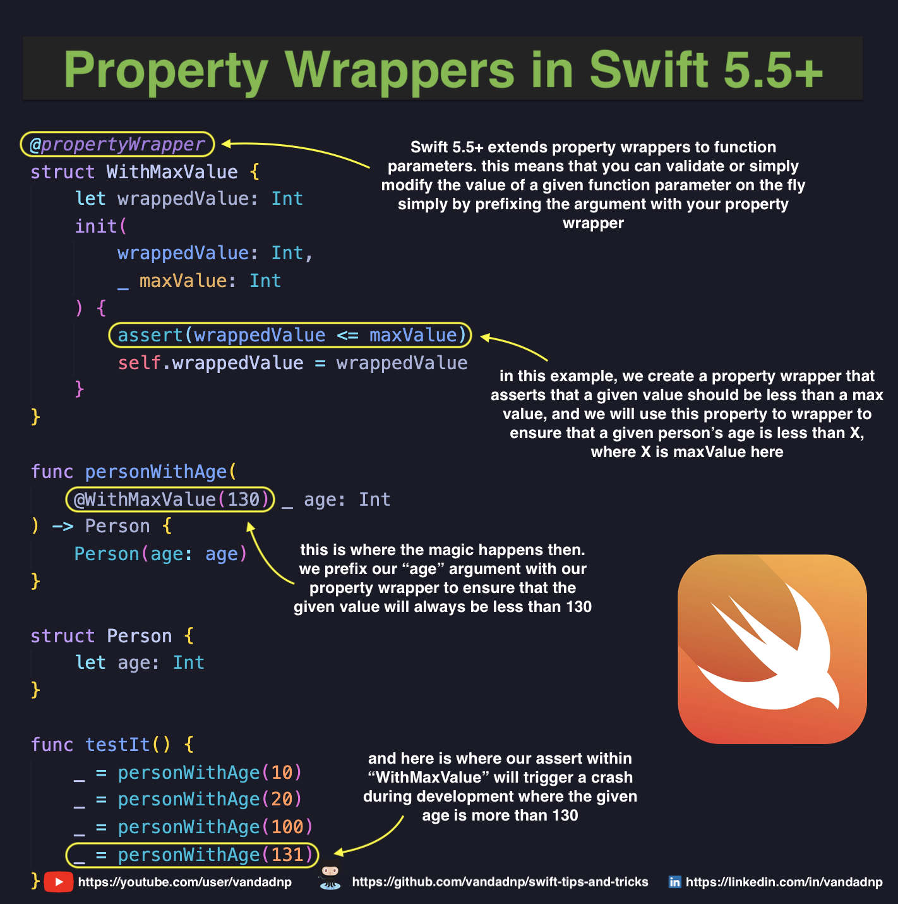
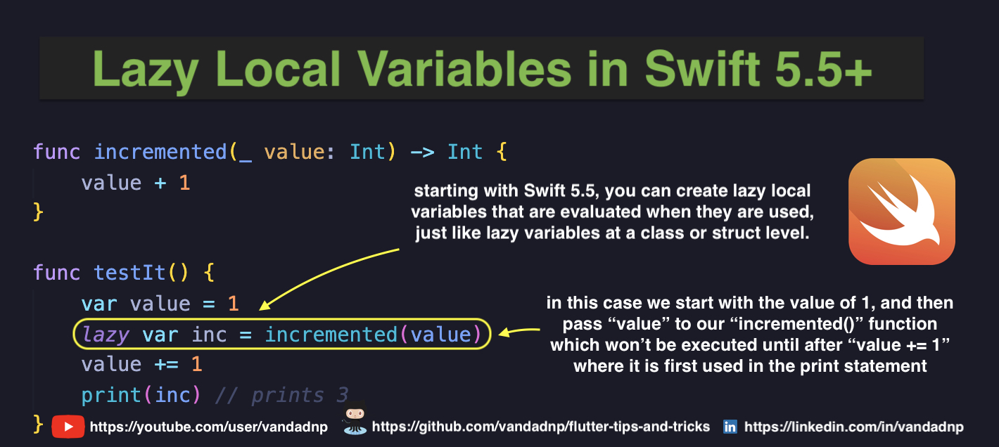

# Table of Contents

* [Finding Objects in `Array<T>` in Swift Using Key Paths](#finding-objects-in-arrayt-in-swift-using-key-paths)
* [Property Wrappers in Swift 5.5+](#property-wrappers-in-swift-55)
* [Lazy Local Variables in Swift 5.5+](#lazy-local-variables-in-swift-55)
* [Actors in Swift 5.5+](#actors-in-swift-55)
* [Async Getters in Swift 5.5+](#async-getters-in-swift-55)
* [Custom `Sequence` in Swift](#custom-sequence-in-swift)
* [Sum of Any Numeric Types in Swift](#sum-of-any-numeric-types-in-swift)
* [Finding Elements of Specific Type in Swift](#finding-elements-of-specific-type-in-swift)
* [Synthesized Raw Enum Values in Swift](#synthesized-raw-enum-values-in-swift)

# Finding Objects in `Array<T>` in Swift Using Key Paths

[Source Code](source/finding-objects-in-arrayt-in-swift-using-key-paths.swift)

# Property Wrappers in Swift 5.5+

# Lazy Local Variables in Swift 5.5+

# Actors in Swift 5.5+

# Async Getters in Swift 5.5+

# Custom `Sequence` in Swift

# Sum of Any Numeric Types in Swift

# Finding Elements of Specific Type in Swift

# Synthesized Raw Enum Values in Swift

